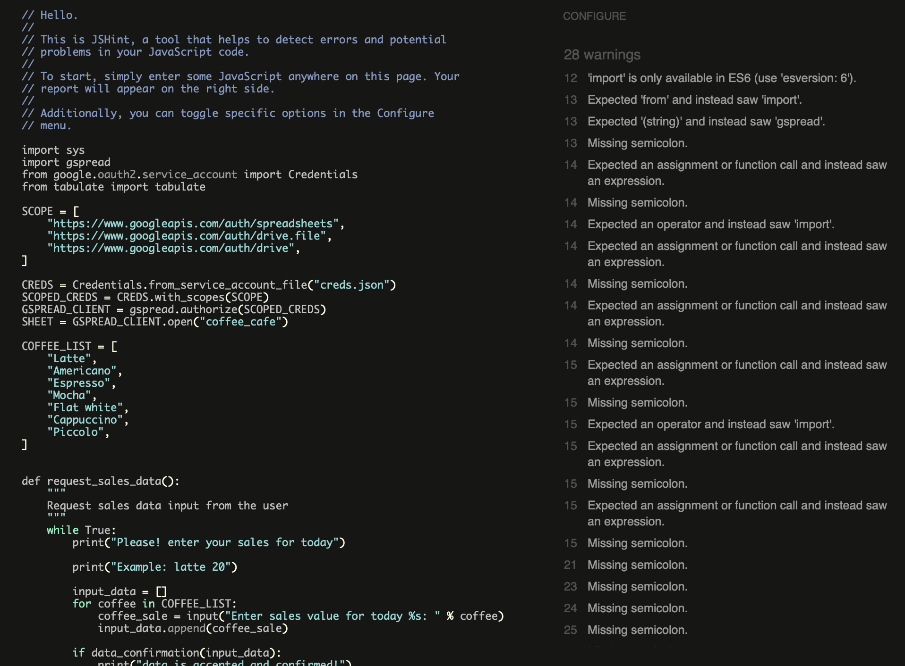
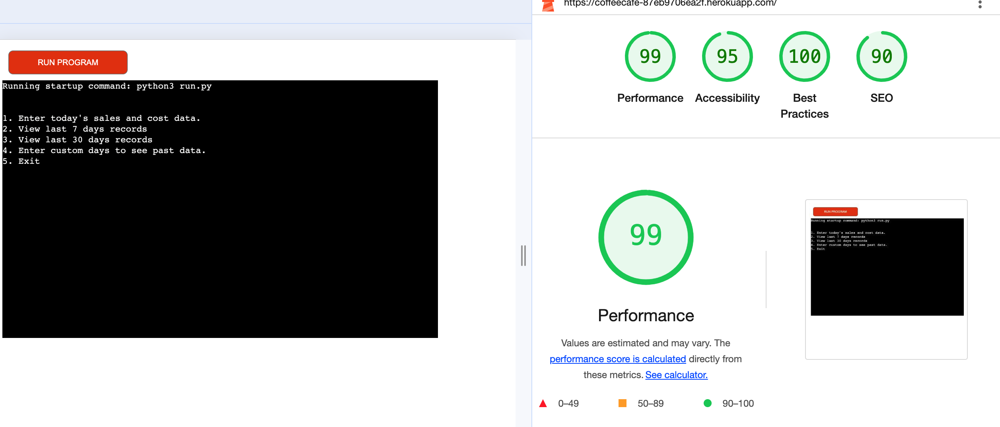

# cofeecafe

Welcome to Coffee Cafe!

This is a Cafe shop that helps owner determine his profit and loss which helps to forecast on the future of the business. The projects works in such a way that it helps the cafe owner to  input the sales value and the cost value for 7 coffees brand for each day of transaction. 

This app automatically calculates the profit and loss, so the user will know if he or she has been making profit or loss, and if the loss is more than the profit for a particular coffee brand the owner of the cafe will able to make wise decision decision in favour of the cafe.

The cafe owner can decide to streamline his available product for sale to just 5, where the user can pick from so as to enable getting sales values for previous sales which might be used to forecast on the future running of the coffee cafe.

This project was inspired after concluding on my rock, paper and scissors project, so I discovered that if it’s in the real world; guessing is not the best choice.

## Features

This section talks about the different options available for the user and the cafe owner that will help the user be satisfied and the cafe owner come to a more fruitful decision. 

The features include: 1, which means to enter today's sales and cost data
                      2, which means to view last 7 days record
                      3, which means to view last 30days record
                      4, which means to enter custom days to see past data.
All of this sections makes the app more realistic because it gives the user more options to look at.

### Storage data

  - Every data used and generated has been saved in the google sheet, This sheet is connected to the code through the  Google Drive and Google sheet API by the Google Cloud Platform. This method allows me to send and also receive data beacause i have accessed the Google sheet API credentials. I also added in the Config Vars to these credentials when i was deploying the project in Heroku. Because of the sensitive nature of the data, the creds.json was added to the gitignore file. This ensures that the credentials are not pushed to the respository.

- __The coffeecafe google sheet__

 Here shows the list of sales, cost and surplus that are updated to the worksheet
 
- __Languages and Package Used__
  
    Python
    Gspread
    goog.oautg2.service_account
  

### Frameworks

  Git: Git was used for version control by utilizing Gitpod terminal
  GitHub: GitHub is used to store the project's code after it's pushed from Git
  Heroku: Used to deploy the live projects
  PEP8: This is used to validate all python code
  
  
## Testing

__Lighthouse__
  
  
  
### Validator Testing

- JavaScript
  - No errors were found when passing through the official [Jshint validator](https://jshint.com/)
    - The following metrics were returned:
    - 26 warnings were found
    
### Unfixed Bugs

Since the deployment terminal is set to 80 columns by 24 rows and what i had was more than that, some lines were wrapped to the next line. This is the contraint i experienced.

The link to my definition of selling price - cost price was gotten from the link below: https://www.cuemath.com/profit-formula/#

Every thing done in the code was from the videos i watched from the lessons and also my mentor was very handy by putting me through every step of the day way.

## Deployment
This project was deployed by completing the steps below:

  - Log in to Heroku or creating an account
  - On the main page click the button labelled new in the top right corner and from the drop-down menu select new app
  - Enter a unique app namne
  - Select a region
  - Click on the create app button
  - Click on settings to go to the config Vars, then reveal it
  - CREDS where we have keys and everything in the creds list in the value box
  - Scroll down to the buildpacks, select python and node as your buildpacks
  - Go to the top of the page and choose Deploy tab
  - Select github as the deployment method
  - put in your repository name
  - Choose if you want to use the automatic or the manaual deploy type
  - Deploy your project

## Credits

- Most of the things done here was from the lessons i learned in the video i watched, and also my mentor who held me by the hand and told me to write the idea first in a book before implementing. The terminal function and template is from code institute

### Special thanks
Special thanks to my mentor sandeep aggarwal and my colleagues at code institute.

